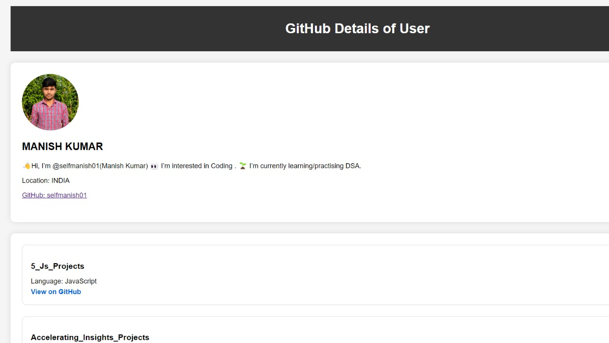

## Screenshots




# GitHub User Details Project

## Overview

This project is a simple web application that fetches and displays GitHub user details and repositories using the GitHub API. It provides a clean and intuitive interface to view user information and explore repositories.

## Features

- Fetches user details (avatar, name, bio, social links) from GitHub.
- Displays a list of repositories with details (name, description, language).

## Getting Started

### Prerequisites

- [GitHub Personal Access Token](https://docs.github.com/en/authentication/keeping-your-account-and-data-secure/creating-a-personal-access-token)

### Installation

1. Clone the repository:

   ```bash
   git clone https://github.com/your-username/github-user-details.git
   ```

2. Open `index.html` in a web browser.

### Configuration

Set your GitHub username and Personal Access Token in `script.js`:

```javascript
const username = 'your-username';
const token = 'your-personal-access-token';
```

## Contributing

Contributions are welcome! If you find any issues or have improvements, feel free to open a [new issue](https://github.com/your-username/github-user-details/issues) or submit a [pull request](https://github.com/your-username/github-user-details/pulls).

## License

This project is licensed under the MIT License - see the [LICENSE](LICENSE) file for details.

## Acknowledgments

- Thanks to GitHub for providing the [GitHub API](https://docs.github.com/en/rest).
